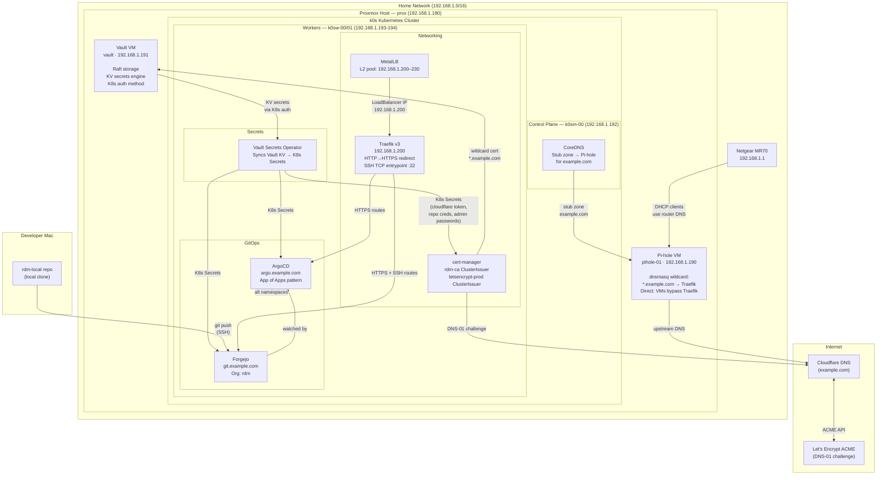

# rdm-local Architecture

## Services

| Service | URL | IP |
|---|---|---|
| Pi-hole | `http://pihole-01.example.com/admin` | 192.168.1.190 |
| Vault | `https://vault.example.com` | 192.168.1.191 |
| Traefik | `https://traefik.example.com` | 192.168.1.200 |
| ArgoCD | `https://argo.example.com` | 192.168.1.200 |
| Forgejo | `https://git.example.com` | 192.168.1.200 |

## Credential Storage

All secrets are stored in Vault at `secret/<service>/...` and synced into Kubernetes via VSO where needed. The Ansible pihole role reads Pi-hole's admin password from Vault at deploy time.
